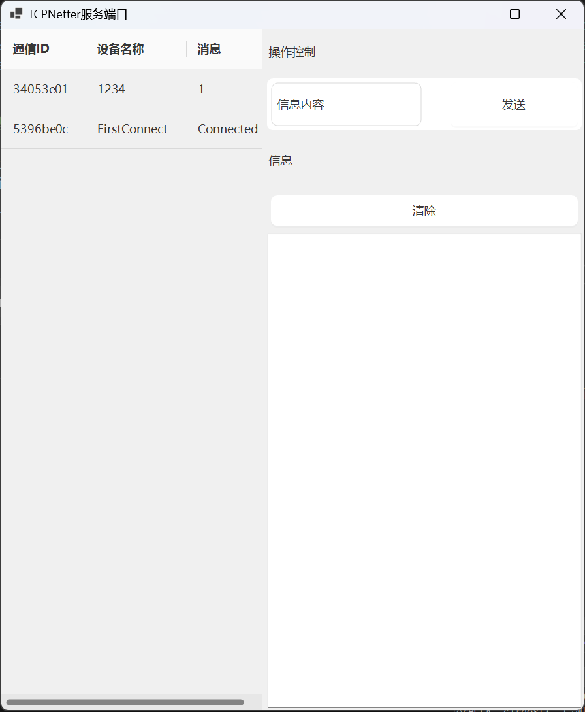
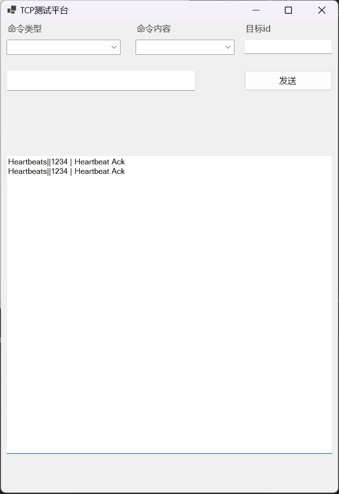

# TCPNetter

使用DotNetty编写的建议TCP服务器客户端工具Demo，具备如下功能

1. 掉线重连，无论关闭客户端还是服务器，只要另一边上线即可
2. 客户端脱离框架，使用语言原生库编写（因此理论上支持任何一种语言链接扩展）
3. 消息控制，Message的传输，一边可以修改另一边，或者另一边接受，可以扩展为控制逻辑或者自定义聊天交互等

服务端打开 TCPNetterServerGUI

客户端打开 TCPNetter

### 界面说明

> UI界面 将来会更新，不一定保证文档和实际情况一致性

##### 服务侧

左侧为设备信息列表，右侧为操作区域，可以发送消息



##### 客户端侧

上区域为命令选择和交互区域，下半部分为界面



### 数据格式

##### 消息

```
public class MessageModel
{
    /// <summary>
    /// 数据来源ID，也是通道ID
    /// </summary>
    public string? Id { get; set; }

    /// <summary>
    /// 数据类型，有
    /// - Heartbeats 心跳包
    /// - Echo 回响包
    /// - Command 指令包
    /// - Message 消息包 ...
    /// </summary>
    public string? MessageType { get; set; }

    /// <summary>
    /// 设备名称
    /// </summary>
    public string? DeviceName { get; set; }

    /// <summary>
    /// 数据信息
    /// </summary>
    public string? Message { get; set; }

    /// <summary>
    /// 命令内容，用于处理Commad指令。结合 MessageType 为 Command 时
    /// </summary>
    public string? Command { get; set; }

    /// <summary>
    /// 用于指向服务。结合 MessageType 为 Command 时
    /// </summary>
    public string? Target { get; set; }
}
```

##### 保存（历史记录）

```
public class SaveModel
{
    /// <summary>
    /// 设备名称
    /// </summary>
    public string? DeviceName { get; set; }
    /// <summary>
    /// 数据来源ID(通道ID)，每次都会变化
    /// </summary>
    public string? Id { get; set; }
    /// <summary>
    /// 数据信息
    /// </summary>
    public string? Message { get; set; }
    /// <summary>
    /// 时间戳 格式为 yyyy-MM-dd HH:mm:ss
    /// </summary>
    public string? Datetime { get; set; }
}
```

### 命令说明

数据间存在如下命令

| 名称       | 说明                 | 需求参数                              |
| ---------- | -------------------- | ------------------------------------- |
| Heartbeats | 心跳数据             | MessageType、DeviceName               |
| Echo       | 回响数据             | 任意                                  |
| Command    | 命令数据             | MessageType、Command、Target、Message |
| Message    | 消息数据             | MessageType、DeviceName、Message      |
| Callback   | 确认收到，需要回应   | MessageType、DeviceName、Message      |
| NoCallback | 确认收到，不需要回应 | MessageType、DeviceName、Message      |
| default    | 错误请求             | 无                                    |

命令Command包含以下子指令

| 名称              | 说明                                       | 请求参数              |
| ----------------- | ------------------------------------------ | --------------------- |
| Broadcast         | 广播这个消息给其他受控制端口               | Message               |
| SendMessageById   | 定点发送给某一特殊客户端消息(通过通道Id)   | Target（id）、Message |
| SendMessageByName | 定点发送给某一特殊客户端消息(通过设备名称) | Target（name）        |
| GetAll            | 获取全部的服务信息                         |                       |
| GetMyHistory      | 获取自身获取历史记录                       |                       |
| GetHistory        | 根据ID获取历史记录                         | Target（名称）        |

注意。上表格中id = 通道id，每一次通讯建立的时候会自动随机生成的，系统保证唯一，name = 设备名称，属于用户自己创建的名称，需要自行处理是否唯一

### TODO

1. 服务侧增加更多命令
2. 服务侧可以本地化保存信息
3. 支持更多的数据类型